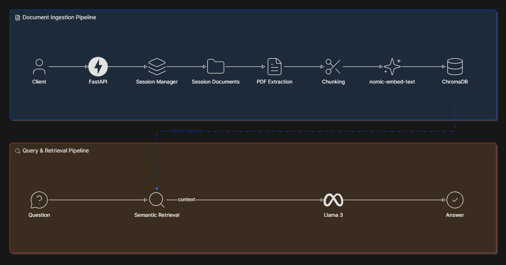

# DocTeach

A session-based Retrieval-Augmented Generation (RAG) platform for querying PDF documents using local AI models.

DocTeach enables users to upload documents, create isolated knowledge bases, and interact with them through natural language. The system combines semantic search, vector databases, and local large language models to provide grounded answers directly from uploaded content.

---

## Motivation

Most document assistants either:

* Depend on external APIs
* Require cloud infrastructure
* Mix documents into a single knowledge base
* Lack transparency into retrieval workflows

DocTeach was built as a fully local, session-oriented RAG system designed to explore modern retrieval architectures and provide a foundation for production-grade MLOps practices.

---

## Key Features

### Session-Based Architecture

Each session maintains its own:

* Uploaded documents
* Vector database
* Retrieval pipeline
* Context window

This prevents document contamination between conversations and mirrors how enterprise document systems manage isolated knowledge bases.

### Local AI Stack

No external AI APIs are required.

Models are served locally through Ollama:

* Llama 3 for answer generation
* nomic-embed-text for embeddings

### Retrieval-Augmented Generation

Documents are:

1. Extracted
2. Chunked
3. Embedded
4. Stored in ChromaDB

Questions are answered using retrieved document context rather than model memory.

### FastAPI Backend

The platform exposes a REST API for:

* Session creation
* Document ingestion
* Question answering

---

## System Architecture



---
## Continuous Integration

DocTeach uses GitHub Actions for automated validation.

Every push and pull request triggers:

* Dependency installation
* Automated test execution (pytest)
* Docker image build verification

This ensures code quality and deployment readiness before changes are merged.


## Technology Stack

### Backend

* Python
* FastAPI

### AI / RAG

* Ollama
* Llama 3
* nomic-embed-text
* LangChain

### Retrieval

* ChromaDB

### Document Processing

* PyMuPDF

### Infrastructure

* Git
* GitHub

---

## API Overview

### Create Session

```http
POST /sessions
```

Creates an isolated document workspace.

---

### Upload Document

```http
POST /sessions/{session_id}/upload
```

Uploads and ingests a PDF.

Pipeline:

```text
PDF
↓
Text Extraction
↓
Chunking
↓
Embeddings
↓
ChromaDB
```

---

### Ask Question

```http
POST /sessions/{session_id}/ask
```

Pipeline:

```text
Question
↓
Semantic Retrieval
↓
Context Construction
↓
Llama 3
↓
Answer
```

---

## Current Capabilities

* Session management
* PDF ingestion
* Semantic chunking
* Embedding generation
* Vector search
* Retrieval-Augmented Generation
* Local LLM inference
* REST API integration

---

## Current Status

### v0.2.0

Implemented:

- Session-based architecture
- PDF ingestion pipeline
- ChromaDB vector storage
- Retrieval-Augmented Generation
- Ollama integration
- Environment-based configuration
- Structured logging
- File logging
- Automated testing with pytest

## Roadmap


### v0.3.0

* Docker support
* Containerized deployment

### v0.4.0

* GitHub Actions CI/CD
* Automated validation pipelines

### v0.5.0

* Deployment workflows
* Monitoring and observability

### v1.0.0

* Production-ready release

---


## Learning Objectives

This project serves as a practical exploration of:

* Retrieval-Augmented Generation (RAG)
* Vector databases
* Semantic search
* FastAPI backend development
* Local LLM deployment
* MLOps workflows
* Production-oriented AI system design

---

## License

MIT License
